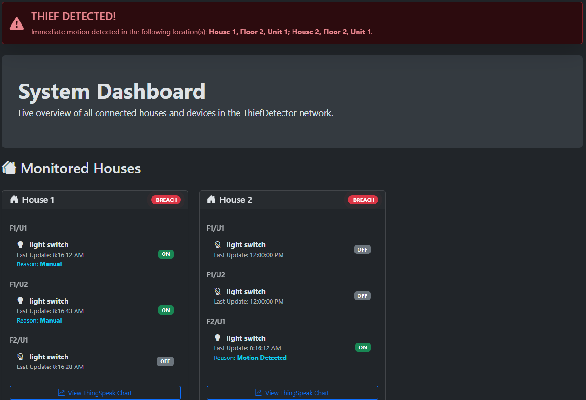
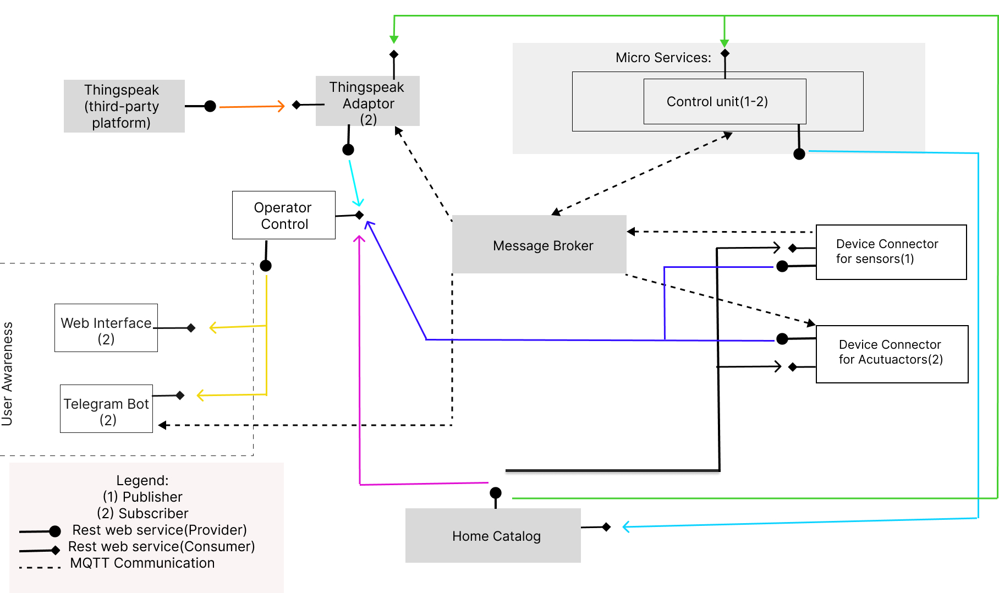

# 🛡️ ThiefDetector IoT System

[](https://www.python.org/)
[](https://www.docker.com/)
[](https://mqtt.org/)

A comprehensive, microservice-based IoT system for home security monitoring. This project simulates a network of sensors and actuators to detect and respond to potential intrusions, providing real-time updates through a web dashboard, a ThingSpeak channel, and a Telegram bot.



---

## ✅ Features

-   **Microservice Architecture**: Fully containerized with Docker Compose for a single-command setup and maximum scalability.
-   **Real-time Web Dashboard**: A dynamic, single-page application that provides a live overview of all connected devices and their statuses.
-   **Intelligent Automation**: Automatically turns lights ON for motion detection or low ambient light, and provides on-screen reasons for its actions.
-   **Dynamic Alerts**: Both the global and per-house alerts are time-sensitive and will automatically clear after a period of inactivity.
-   **Cloud Integration**: Pushes sensor and actuator data to ThingSpeak for historical analysis and visualization.
-   **Remote Control & Alerts**: A Telegram bot allows users to claim and monitor devices and receive real-time motion alerts.
-   **Dynamic Service Discovery**: A central Catalog service allows all components to discover each other dynamically within the Docker network.

---

## 🛠️ Technology Stack

-   **Backend**: Python, CherryPy, Flask
-   **Frontend**: HTML, CSS, JavaScript, Bootstrap 5
-   **Messaging**: MQTT (Eclipse Mosquitto Broker)
-   **Containerization**: Docker & Docker Compose

---

## 🏛️ Architecture Overview

The system follows a microservice architecture where each component is a standalone Docker container. Services communicate through REST APIs for configuration and an MQTT message broker for real-time events.



### Microservice Connections

The following table details the communication paths between each service:

| From Service             | To Service                 | Connection Type | Publisher/Provider or Subscriber/Consumer | Purpose                                            |
| ------------------------ | -------------------------- | --------------- | ----------------------------------------- | -------------------------------------------------- |
| **Sensors** | **Message Broker** | MQTT            | Publisher                                 | Publishes sensor data (light, motion).             |
| **Control Unit** | **Message Broker** | MQTT            | Subscriber & Publisher                    | Subscribes to sensor data, publishes commands.     |
| **Actuators** | **Message Broker** | MQTT            | Subscriber                                | Subscribes to commands to change its status.       |
| **ThingSpeak Adaptor** | **Message Broker** | MQTT            | Subscriber                                | Subscribes to sensor data.                         |
| **Telegram Bot** | **Message Broker** | MQTT            | Subscriber                                | Subscribes to alerts.                              |
| **Operator Control** | **Sensors & Actuators**| REST            | Consumer                                  | Gets the current list/status of devices.           |
| **Operator Control** | **Home Catalog** | REST            | Consumer                                  | Gets the overall structure of houses/units.        |
| **Web Interface** | **Operator Control** | REST            | Consumer                                  | Gets all data needed for the dashboard.            |
| **Telegram Bot** | **Operator Control** | REST            | Consumer                                  | Gets detailed status reports on demand.            |
| **Control Unit** | **Home Catalog** | REST            | Provider                                  | Updates the catalog with the latest device status and command reason. |
| *All Services* | **Home Catalog** | REST            | Consumer                                  | Get initial configuration (broker IP, etc.).       |

---

## ⚙️ Configuration

Before running the system, you must configure a few credentials:

1.  **ThingSpeak API Keys**:
    -   Open `ThingSpeak/adaptor.py`.
    -   Update the `self.api_keys` dictionary with your own ThingSpeak Channel Write API Keys.

2.  **Telegram Bot Token**:
    -   Open `User_awareness/telegram_bot.py`.
    -   At the bottom, replace the placeholder `token` with your Telegram Bot token from BotFather.

3.  **Telegram User ID (for device ownership)**:
    -   Talk to the `@userinfobot` on Telegram to get your unique Chat ID.
    -   Open `User_awareness/device_ownership.json`.
    -   Replace `"592396681"` with your own Chat ID to claim ownership of a device.

---

## 🚀 Getting Started with Docker

This project is fully containerized, making setup incredibly simple.

### Prerequisites

-   [Docker](https://www.docker.com/get-started)
-   [Docker Compose](https://docs.docker.com/compose/install/)

### Installation & Launch

1.  **Clone the Repository**
    ```bash
    git clone <your-repository-url>
    cd <your-repository-folder>
    ```

2.  **Perform Configuration**
    -   Follow the steps in the **Configuration** section above to add your API keys and tokens.

3.  **Build and Run the System**
    -   From the root directory of the project, run the following single command:
    ```bash
    docker-compose up --build
    ```
    -   This will build the Docker image for all services and start the entire system.

4.  **Access the Dashboard**
    -   Once the containers are running, open your web browser and navigate to:
    -   **`http://localhost:8000`**

5.  **Interact with the Telegram Bot**
    -   Find your bot on Telegram and use the `/menu` command to start tracking your devices.

